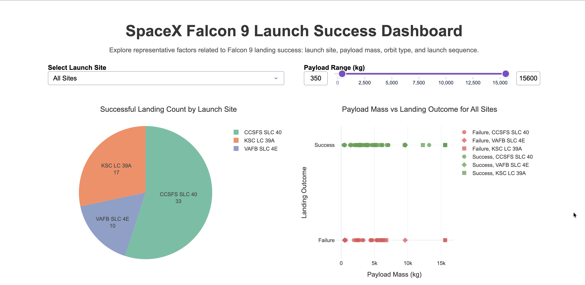
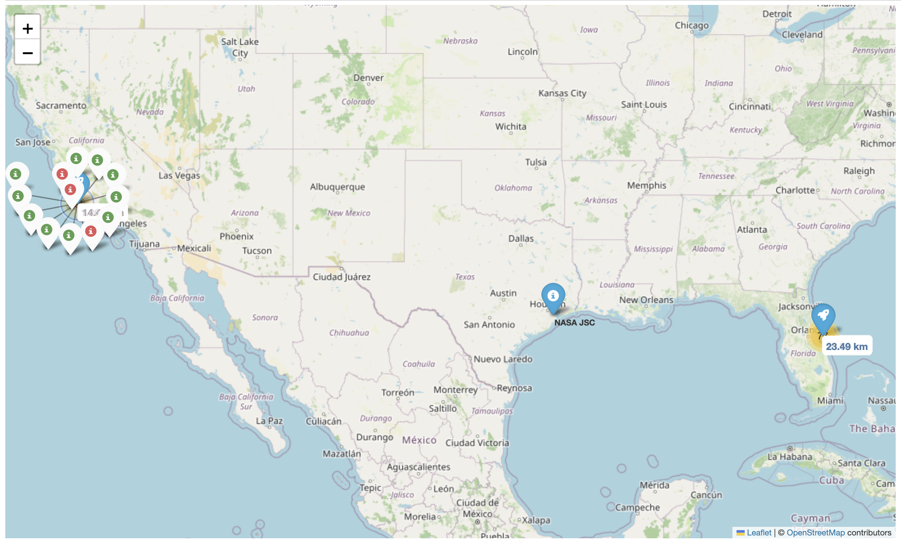

# 🚀 SpaceX Falcon 9 Launch Success Analysis

A complete Falcon 9 launch success analysis project using Python, SQL, machine learning, geographic visualization, and an interactive Dash dashboard.

---

## 📸 Project Preview

### Dashboard Preview



### Geographic Visualization Preview



---

## 📂 Main Files

- 📓 [Jupyter Notebook Analysis](notebooks/spacex_analysis.ipynb)
- 📊 [Dash Dashboard App](dashboard/spacex-dash-app.py)
- 🗺️ Geographic Visualization Maps (`outputs/maps/`)
- ⚙️ [Project Requirements](requirements.txt)

---

## 🎯 Project Overview

This project analyzes SpaceX Falcon 9 launch data to explore the factors associated with successful first-stage landings.

The project follows a complete data science workflow:

- Data collection from the SpaceX API and Wikipedia web scraping
- Data cleaning and feature engineering
- SQL-based analysis
- Exploratory data analysis and visualization
- Geographic launch-site analysis
- Machine learning classification
- Interactive dashboard development with Dash

The primary goal is to understand launch-success patterns and build machine learning models that predict whether a Falcon 9 first-stage landing will succeed.

---

## 🎯 Key Questions

- Which launch sites have the highest landing success rates?
- How do payload mass, orbit type, and launch sequence relate to landing outcomes?
- How are launch sites geographically positioned near coastlines and transportation infrastructure?
- Which machine learning model performs best for predicting Falcon 9 landing success?

---

## 🧱 Project Structure

```text
spacex-launch-analysis/
├── data/
│   ├── spacex_launches_cleaned.csv
│   ├── spacex_web_scraped.csv
│   └── spacex_launches.db
├── notebooks/
│   └── [spacex_analysis.ipynb](notebooks/spacex_analysis.ipynb)
├── dashboard/
│   └── [spacex-dash-app.py](dashboard/spacex-dash-app.py)
├── outputs/
│   ├── figures/
│   └── maps/
├── README.md
└── [requirements.txt](requirements.txt)
```

---

## 📊 Data Sources

### 1. SpaceX API

The primary launch dataset was collected using the SpaceX REST API.

### 2. Wikipedia Web Scraping

Supplementary launch records were scraped from Wikipedia to validate and enrich the dataset.

---

## 🧹 Data Processing and Feature Engineering

The notebook performs the following preparation steps:

- Filters the dataset to Falcon 9 launches
- Handles missing values, especially payload mass
- Standardizes launch-site and launch-outcome fields
- Converts landing outcome into a binary classification target:
  - `1 = Success`
  - `0 = Failure`
- Creates `OutcomeLabel` for visualization:
  - `Success`
  - `Failure`

The final cleaned dataset is exported as:

```text
data/spacex_launches_cleaned.csv
```

This dataset is used for both machine learning and dashboard visualization.

---

## 📈 Exploratory Data Analysis

The EDA section explores:

- Launch frequency by site
- Success rate by launch site
- Payload mass vs. landing outcome
- Orbit type vs. success rate
- Flight number vs. landing outcome
- Launch trends over time

A consistent visualization color system is used throughout the project:

- Blue → neutral and summary metrics
- Green → successful landings
- Red → failed landings
- Orange / gray / purple → supporting geographic infrastructure information

---

## 🗃️ SQL Analysis

SQLite and pandas are used for SQL analysis to improve reproducibility and avoid notebook magic dependency issues.

---

## 🗺️ Geographic Analysis

Folium is used to visualize launch-site geography and nearby infrastructure.

The final map structure includes:

### Global Overview Map
- NASA Johnson Space Center
- All Falcon 9 launch sites
- Launch-site overview context

### Florida Regional Map
- CCSFS SLC 40
- KSC LC 39A
- Launch distributions
- Infrastructure distance lines

### California Regional Map
- VAFB SLC 4E
- Launch distributions
- Infrastructure distance lines

Distances to the nearest coastline, city, railway, and highway are calculated using the Haversine formula.

---

## 🤖 Machine Learning

The project compares four classification models:

- Logistic Regression
- Support Vector Machine (SVM)
- Decision Tree
- K-Nearest Neighbors (KNN)

The workflow includes:

- Train-test split before scaling to avoid data leakage
- Feature scaling using `StandardScaler`
- Hyperparameter tuning with `GridSearchCV`
- Cross-validation accuracy comparison
- Test accuracy evaluation
- Confusion matrix analysis

When multiple models produce identical evaluation scores, the project favors the simpler and more interpretable model as the preferred baseline.

---

## 📊 Interactive Dashboard

The Dash dashboard focuses on the most representative Falcon 9 mission factors:

- Launch site
- Payload mass
- Orbit type
- Flight number / launch sequence
- Landing outcome

Run the dashboard from the project root:

```bash
python dashboard/spacex-dash-app.py
```

Then open:

```text
http://127.0.0.1:8050/
```

---

## 🛠️ Installation

Install dependencies:

```bash
pip install -r requirements.txt
```

Recommended Python version:

```text
Python 3.9+
```

---

## 🚀 Key Insights

- Launch success varies significantly across launch sites.
- Payload mass alone does not fully explain landing success.
- Mission profile variables such as orbit type and payload mass appear to influence landing outcomes.
- Geographic location reflects a balance between safety, coastal access, and transportation infrastructure.
- Machine learning performance improves when engineered features are used consistently.

---

## 📌 Conclusion

This project demonstrates a complete applied data science workflow using real aerospace launch data. It combines data collection, SQL analysis, visualization, geospatial reasoning, machine learning, and dashboard development into a coherent Falcon 9 launch-success analysis project.
